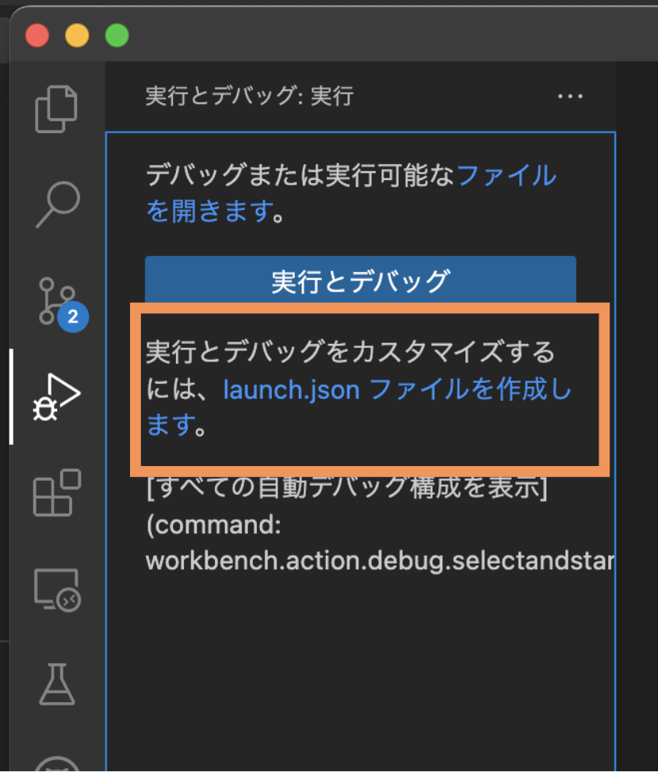
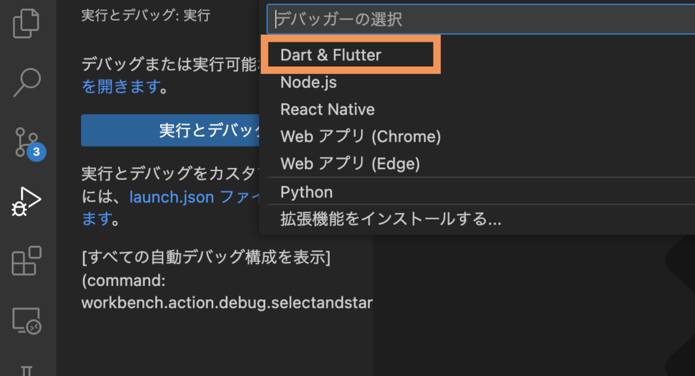

# ビルド環境 設定マニュアル
launch.jsonファイルを使用して設定を行います。

## launch.jsonファイルがない場合
  1. ウィンドウ左のナビゲーションバーから実行とデバッグを押下し、
  「launch.jsonファイルを作成します。」を押下します。
  
  1. デバッガーの選択から「Dart&Flutter」を押下します。
  
  1. プロジェクトディレクトリの「.vscode」直下に「launch.json」が作成されます。

## launch.jsonの設定
  launch.jsonの「configurations」要素に構成を追加することで、環境を作成することができます。

  ```json
  {
    "version": "0.2.0",
    "configurations": [
      // 実行構成
      {
        "name": "android (debug mode)", // 実行名
        "request": "launch",            // 実行方法
        "type": "dart",                 // デバッガータイプ
        "flutterMode": "debug",         // Flutterの実行モード
        "program": "lib/main.dart",     // 実行ファイル名
        "args": ["-d","emulator-5554"]  // コマンド引数
      },
    ]
  }
  ```
  ### 設定属性
   - name</br>
   構成の名前を入力します。実行するプログラムを選択する際に表示されます。
   - request</br>
   実行の方法を入力します。</br>
   「launch」もしくは「attach」が入力できます。プログラムを0から実行する場合は「launch」で、実行中のプログラムに組み込む場合は「attach」を入力します。</br>
    flutterの場合はプログラムを0から実行するため「launch」を入力します。
   - type</br>
   使用するデバッガーのタイプを入力します。</br>
   flutterの場合は「dart」を入力します。
   - flutterMode</br>
   flutterアプリの実行タイプを入力します。「debug」「profile」「release」モードが選択できます。
   - program</br>
   実行ファイルの名前を入力します。
   - args</br>
   プログラムに渡すコマンド引数を入力します。


  ### コマンド引数の「d」オプション
  プログラムを実行するデバイスのIDを入力します。

  #### デバイスIDの確認方法
  「flutter devices」コマンドを実行することで接続可能なデバイスの情報を確認できます。
  ```commandline
  $flutter devices
  4 connected devices:

  sdk gphone64 x86 64 (mobile) • emulator-5554                        • android-x64    • Android 13 (API 33) (emulator)
  iPhone 14 Pro Max (mobile)   • 95CD98C2-5F1A-40CC-827A-C5F27BABB455 • ios            • com.apple.CoreSimulator.SimRuntime.iOS-16-2 (simulator)
  macOS (desktop)              • macos                                • darwin-x64     • macOS 12.5.1 21G83 darwin-x64
  Chrome (web)                 • chrome                               • web-javascript • Google Chrome
  ```
  デバイス情報は以下のように表示されます。
  ```commandline
  <名前> • <デバイスID> • <OS> • <バージョン>
  ```

  上記例の場合androidエミュレーターとiosエミュレーターのデバイスIDは以下のようになります。
   - Android : emulator-5554
   - iOS : 95CD98C2-5F1A-40CC-827A-C5F27BABB455

## 設定例
以下のファイルに設定例があります。</br>
[flavor/launch.json](launch.json)

## 参考リンク
- [launch.jsonファイルについての公式ドキュメント](https://code.visualstudio.com/docs/editor/debugging#_launchjson-attributes)
- [flutterでlaunchするデバイスを選択する方法](https://dev.classmethod.jp/articles/master-the-flutter-devicesflutter-run-command-in-flutter-app-development/)
- [flutterModeについて](https://dartcode.org/docs/running-flutter-apps-in-profile-or-release-modes/)

